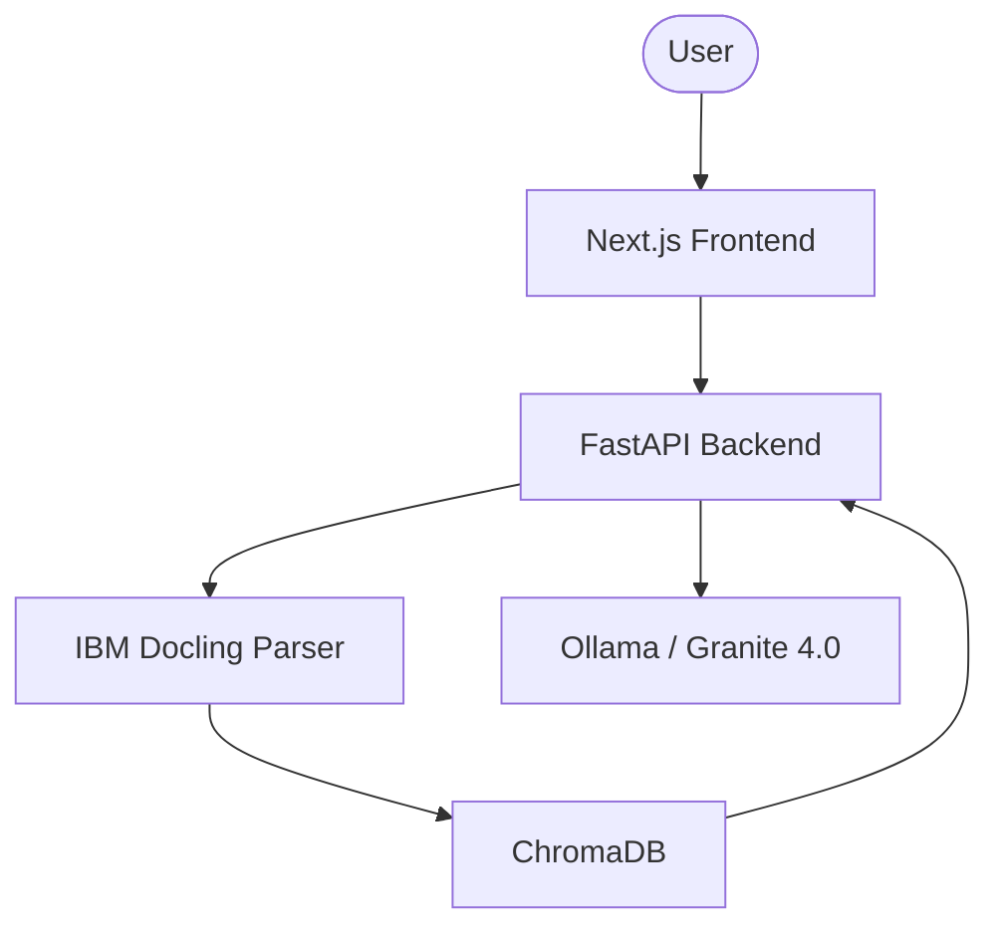

# 🌌 Aetheris Research

[](https://nextjs.org/)
[](https://fastapi.tiangolo.com/)
[](https://ollama.com/)
[](https://opensource.org/licenses/MIT)

**Aetheris Research** is a high-precision, privacy-first AI research assistant designed for academic researchers and designers. It integrates the power of **IBM Docling** for deep PDF structure analysis and **IBM Granite 4.0** for massive 1M token context reasoning.

---

## ✨ Core Features

- 📑 **Layout-Aware Parsing**: Uses IBM Docling to accurately parse multi-column academic papers, tables, and complex figures.
- 🧠 **1M Context Window**: Powered by `granite4:7b-a1b-h` for analyzing entire books or multiple research papers in a single session.
- 🔒 **100% Local & Private**: No data ever leaves your machine. Models run locally via Ollama.
- 🕰️ **Long-Term Memory**: Persistent vector storage using ChromaDB to remember every paper you've ever analyzed.
- 🎨 **Designer-Grade UI**: A premium, minimalist interface built with Next.js and Framer Motion.

---

## 🛠️ Architecture



---

## 🚀 Getting Started

### 1. Setup Models
Ensure you have [Ollama](https://ollama.com/) installed and running, then execute:
```powershell
.\scripts\setup_ollama.ps1
```

### 2. Install Dependencies
```powershell
# Backend
pip install -r backend/requirements.txt

# Frontend
cd frontend
npm install
```

### 3. Launch Aetheris
```powershell
.\scripts\start_dev.ps1
```

---

## 🗺️ Roadmap

- [x] Initial Scaffolding & Branding
- [x] Docling + FastAPI Integration
- [x] 1M Token Context Integration
- [ ] Multi-Modal PDF Analysis (Image parsing)
- [ ] Zotero Integration for Citation Management

---

## 📄 License
Distributed under the MIT License. See `LICENSE` for more information.

---

<p align="center">
  Built with ❤️ for the Academic Community by <b>Shinrinyoku</b>
</p>
